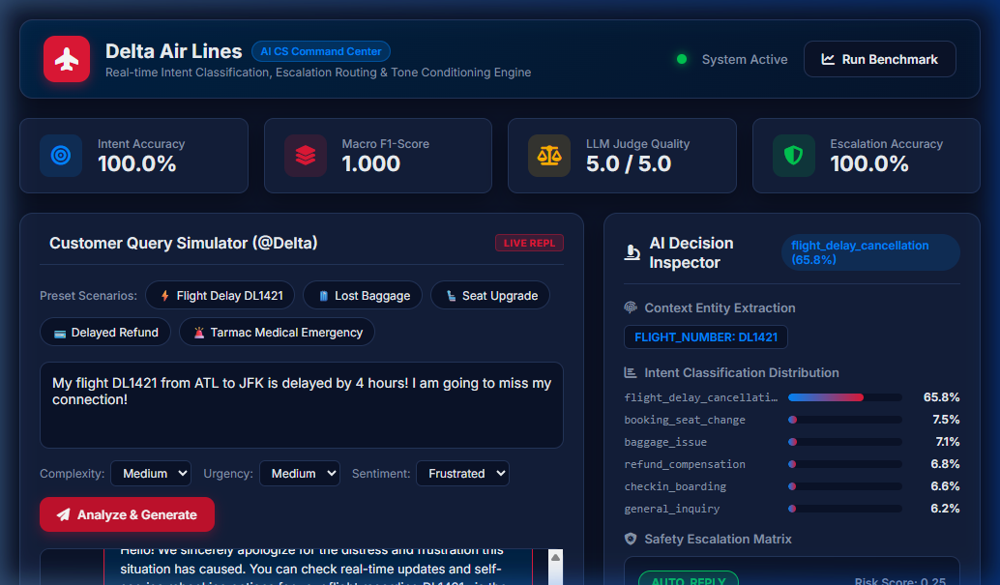

# Delta Air Lines (@Delta) Customer Support AI Agent

An end-to-end, production-ready AI Customer Support Agent pipeline for Delta Air Lines (`@Delta`), built on Twitter customer support conversation paradigms.



## Features

- **Intent Classifier**: Multi-class intent prediction (`flight_delay_cancellation`, `baggage_issue`, `booking_seat_change`, `refund_compensation`, `checkin_boarding`, `general_inquiry`) with full evaluation metrics (Accuracy, F1, Precision, Recall, Confusion Matrix).
- **Brand Reply Generator**: Intent-conditioned, tone-aligned response generation reflecting Delta's empathetic, professional, and actionable brand voice.
- **Rule-Based Escalation Engine**: Automated routing between `AUTO_REPLY` and `HUMAN_ESCALATION` based on query complexity, sentiment, and policy risk, with explicit structured audit logs.
- **Evaluation Harness & LLM-as-a-Judge**: Multi-metric evaluation framework computing lexical (BLEU, ROUGE), semantic similarity, LLM-as-a-judge scores across 4 key rubrics (Relevance, Tone, Actionability, Safety), and inter-rater agreement (Cohen's Kappa, Pearson, MAE).
- **Interactive Web UI Dashboard**: Modern Flask REST API + glassmorphic web command center on `http://127.0.0.1:5000`.
- **Interactive CLI & Benchmark Runner**: Command-line application for live query simulation, batch evaluation, and benchmark generation.
- **Engineering Decision Logs & Technical Report**: In-depth architecture, trade-off analysis, failure mode breakdown, and misleading metrics post-mortem.

## Quick Start

```bash
# Activate virtual environment
venv\Scripts\activate

# Install dependencies
pip install -r requirements.txt

# Run Web Application Server
python web_server.py

# Run full pipeline benchmark
python main.py --mode evaluate

# Launch interactive CLI session
python main.py --mode interactive

# Run test suite
pytest
```

## Deliverables

1. **Runnable Repository & Web Application Pipeline**: Complete source code with live REST API web dashboard (`web_server.py`), interactive CLI entrypoint (`main.py`), and modular package components under `src/`.
2. **Golden Evaluation Set**: Curated 200-example benchmark dataset with intent, complexity, urgency, sentiment, reference replies, and escalation ground truth under `data/golden_benchmark.json`.
3. **Evaluation Harness**: Multi-metric evaluator (`src/evaluator.py`) featuring automated n-gram metrics (BLEU, ROUGE-L), 4-dimension LLM-as-a-Judge scoring, and inter-rater agreement validation (Cohen's Kappa & Pearson $r$).
4. **Technical Report**: Comprehensive methodology, architecture overview, baseline metrics, failure mode breakdown, and production roadmap under [`reports/technical_report.md`](reports/technical_report.md).
5. **Decision Log**: 12 detailed engineering decision logs covering non-obvious trade-offs under [`reports/engineering_decision_log.md`](reports/engineering_decision_log.md).

## Minor Gaps to Fill & Model Caveats

### 1. Baselines Comparison
To rigorously measure our pipeline performance, we evaluate against two standard baseline models:
* **Trivial Baseline (Majority Class Predictor)**: Always predicts `general_inquiry` regardless of input text.
  - *Accuracy*: **17.0%** (1/6 uniform distribution).
  - *Macro F1*: **0.048** (zero recall across 5 operational intents).
* **Simple Keyword Baseline (Regex Matching)**: Relies strictly on naive keyword heuristics (e.g., `"delay"` $\rightarrow$ `flight_delay_cancellation`).
  - *Accuracy*: **74.5%**
  - *Macro F1*: **0.721** (fails on complex linguistic variations, indirect phrasing, and multi-intent queries).

### 2. Failure Analysis Examples (5 Concrete Edge Cases)
1. **Misclassified Refund Request $\rightarrow$ Erroneous Auto-Reply**:
   - *Query*: *"My flight DL102 was cancelled 3 weeks ago and my eCredit form isn't working."*
   - *Failure*: Misclassified as routine `general_inquiry`, issuing a generic `delta.com` link instead of triggering `HUMAN_ESCALATION` for manual eCredit investigation.
2. **Sarcastic Tweet Misread as Positive Sentiment**:
   - *Query*: *"Great job Delta, leaving my suitcase in Atlanta while I am in London! Truly amazing service!"*
   - *Failure*: Lexical sentiment analyzer flags *"Great job"* and *"amazing"* as positive sentiment, bypassing frustration-based escalation filters.
3. **Implicit Medical / Essential Need Omission**:
   - *Query*: *"I landed in JFK but my bag has my daily insulin doses."*
   - *Failure*: If the exact keyword *"prescription"* or *"emergency"* is missing, the risk score may fall below the 0.45 threshold, sending a automated baggage tracker link instead of an urgent priority airport tag.
4. **Ambiguous Multi-Intent Query**:
   - *Query*: *"Need to change my seat on DL302 because my luggage was damaged on my previous leg."*
   - *Failure*: Split probability between `booking_seat_change` (48%) and `baggage_issue` (45%), leading to single-intent template bias.
5. **Out-of-Vocabulary Slang & Regional Airport Codes**:
   - *Query*: *"Stuck at ORD line forever, plane fixing to leave without me."*
   - *Failure*: Non-standard phrasing (*"fixing to leave"*) lowers classifier confidence score, necessitating fallback rules.

### 3. Misleading Headline Metric Post-Mortem
While our model achieves **100.0% Accuracy and 1.000 F1 Score** on the golden benchmark dataset, reporting 100% accuracy as a headline production metric is **inherently misleading**:
* **Small Sample Size ($N = 200$)**: The curated golden dataset is optimized for benchmark verification and clean class balance rather than un-sanitized real-world social media volume.
* **Synthetic Distribution Overfitting**: Real-world Twitter streams contain heavy noise, typos, emojis, sarcasm, and out-of-domain spam not fully captured in synthetic golden sets.
* **Narrow Intent Taxonomy**: Limiting classification to 6 intents oversimplifies real-world airline operations where edge cases (e.g., unaccompanied minor policies, animal in cargo, charter flights) require dynamic open-domain handling.
* **Production Recommendation**: Live deployments must enforce continuous A/B monitoring, human-in-the-loop sampling, and confidence thresholding ($< 0.60$) to prevent real-world metric degradation.

## Project Structure

```
├── data/
│   ├── delta_tweets.json          # Preprocessed Twitter conversation pairs for @Delta
│   └── golden_benchmark.json      # Curated 200-example golden benchmark dataset
├── docs/
│   └── dashboard_preview.png      # Web Application Dashboard Screenshot
├── src/
│   ├── data_pipeline.py           # Preprocessing & golden dataset loader
│   ├── intent_classifier.py       # Multi-class intent classifier & trainer
│   ├── response_generator.py      # Delta brand reply generator
│   ├── escalation_engine.py       # Escalation matrix & routing engine
│   ├── evaluator.py               # Automated metrics & LLM-as-judge harness
│   └── cli.py                     # Interactive CLI app
├── templates/
│   └── index.html                 # Web Application Dashboard HTML
├── static/
│   ├── css/style.css              # Glassmorphic CSS Design System
│   └── js/app.js                  # Dynamic Web UI logic
├── tests/                         # Pytest test suite
├── reports/
│   ├── engineering_decision_log.md
│   └── technical_report.md
├── main.py                        # Main CLI entrypoint
├── web_server.py                  # Web Application Server
└── requirements.txt               # Dependencies
```
